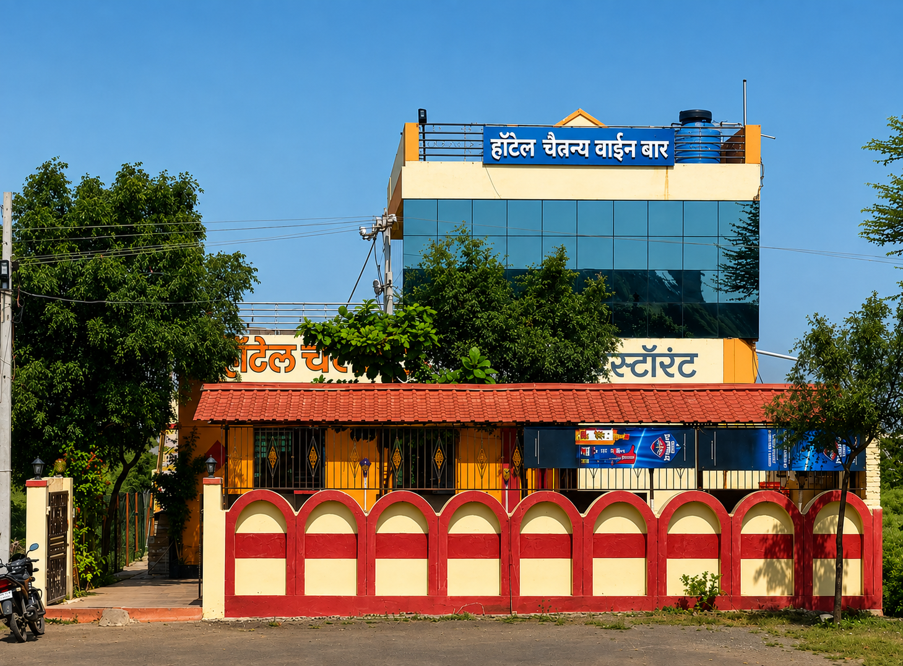

# Hotel-Chaitnya-Management-Website

> A modern, responsive website designed for Hotel Chaitanya Wine Bar, showcasing its menu, ambience, gallery, reservations, and contact information.



---

## ✨ Overview

Hotel Chaitanya Wine Bar is a modern, responsive restaurant website built with a focus on visual presentation, accessibility, performance, and a smooth experience across desktop and mobile devices.

The website provides visitors with an easy way to:

- Explore the restaurant and its ambience
- Browse the food and drinks menu
- View the photo gallery
- Make reservation enquiries through WhatsApp
- Find contact information and location
- Switch between light and dark themes
- Navigate comfortably on mobile and desktop devices

---

## 🚀 Features

### 🎨 Modern UI

- Clean and elegant visual design
- Responsive layout for desktop, tablet, and mobile
- Light and dark theme support
- Smooth scrolling and subtle animations
- Mobile navigation drawer
- Responsive image gallery
- Interactive image lightbox

### 🍽️ Restaurant Experience

- Menu showcase
- Restaurant gallery
- Reservation enquiry via WhatsApp
- Contact section
- Location map
- Customer testimonials
- Newsletter section

### ♿ Accessibility

The website includes several accessibility improvements:

- Semantic HTML5 structure
- Skip-to-content navigation
- ARIA labels
- Keyboard navigation
- Visible focus states
- Accessible modal/lightbox controls
- `prefers-reduced-motion` support
- Appropriate touch target sizes

### 📱 Responsive Design

Designed and tested for different screen sizes, including:

- Desktop
- Laptop
- Tablet
- Mobile
- Small mobile devices
- Landscape mobile screens

---

## 🛠️ Tech Stack

This project uses a lightweight frontend stack:

| Technology | Purpose |
|------------|---------|
| HTML5 | Website structure |
| CSS3 | Styling, layout, animations & themes |
| JavaScript | Interactions and functionality |
| Google Fonts | Typography |
| SVG | Icons and vector graphics |

No frontend framework is required.

---

## 📁 Project Structure

```text
hotel-chaitanya-website/
│
├── assets/
│   └── images/
│       ├── hero/
│       ├── menu/
│       └── gallery/
│
├── css/
│   └── styles.css
│
├── js/
│   └── script.js
│
├── 404.html
├── index.html
├── favicon.svg
├── robots.txt
├── site.webmanifest
├── package.json
├── package-lock.json
├── .editorconfig
├── .gitignore
└── README.md
